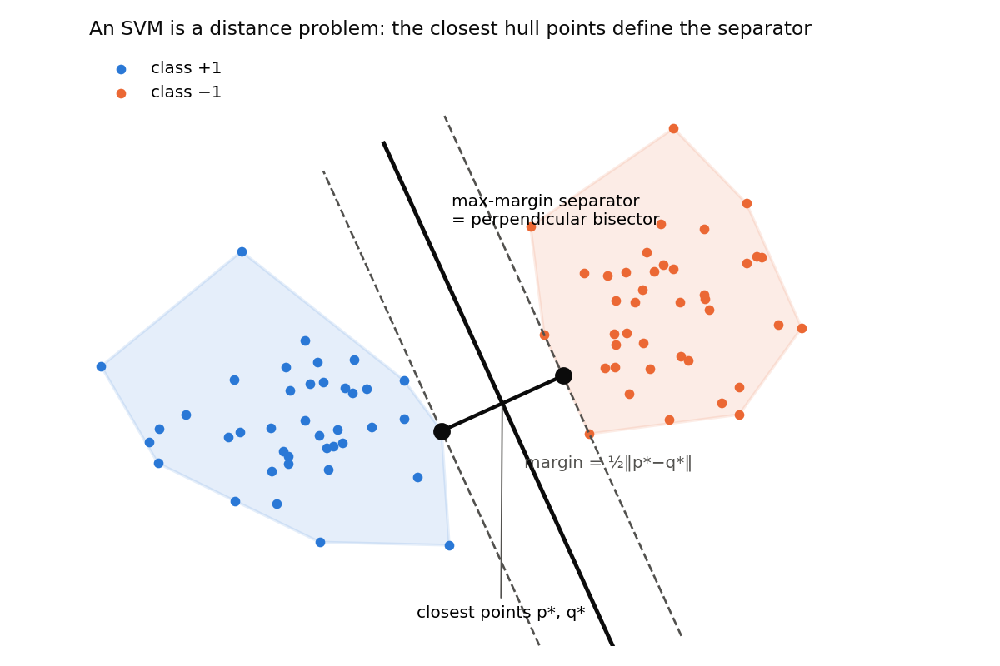
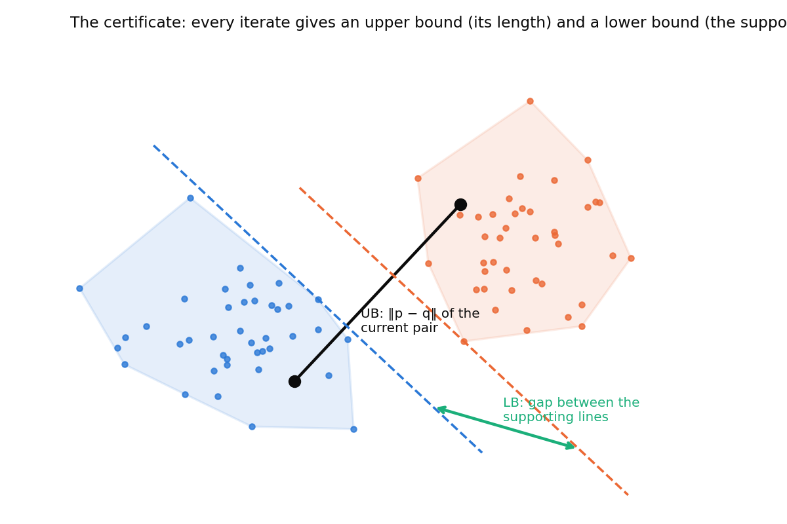
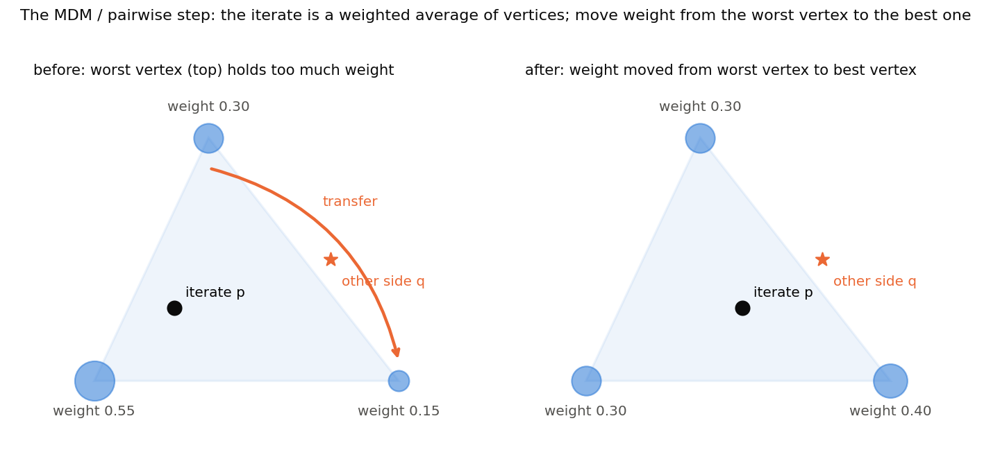
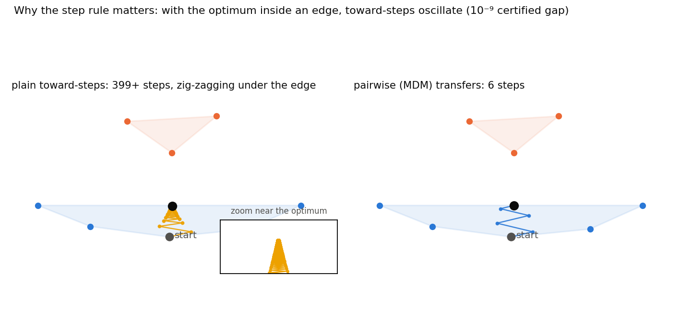
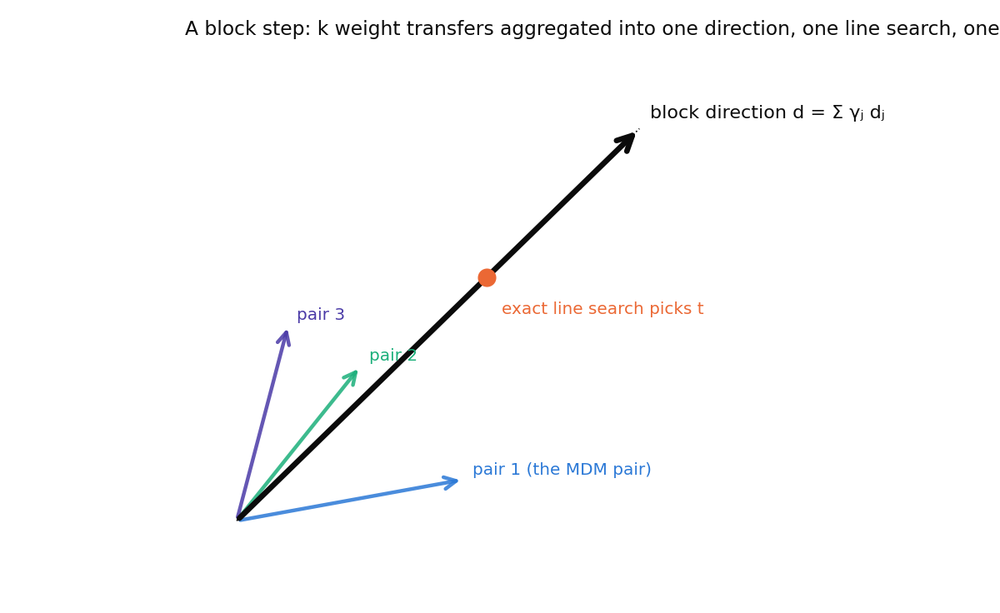
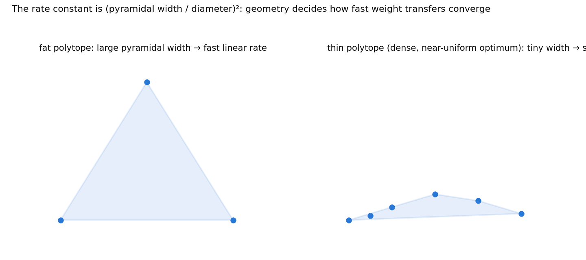
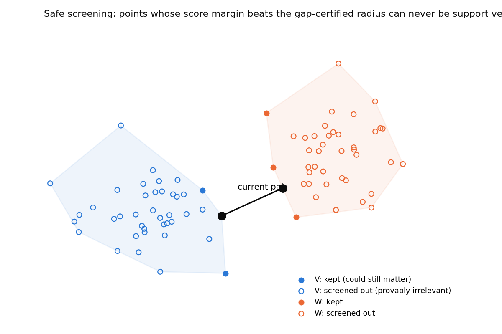
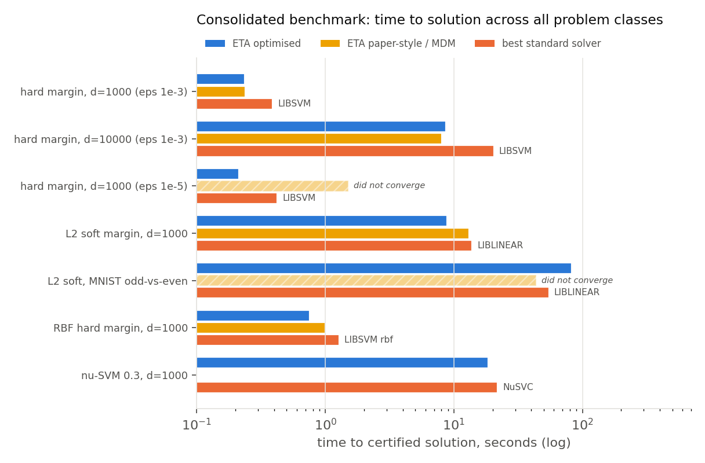
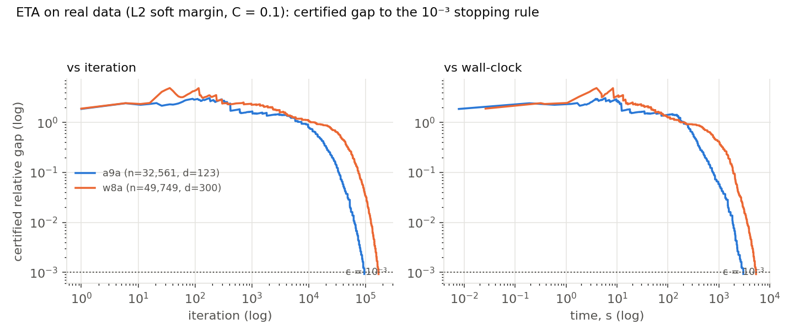

# Training SVMs by Measuring the Distance Between Two Shapes

*How a geometric view of support vector machines turns training into a distance problem with a built-in certificate — and what it took to make that view fast, provable, and honest about where it works.*

---

Most people meet the support vector machine as an optimization problem: minimize ‖w‖² subject to every training point being on the right side of a margin. It's correct, and it's also the least intuitive way to think about what's going on. There is an older, more geometric way to see it, and it's the starting point for everything in this post.

**Take the two classes of training points. Wrap each class in its convex hull — the tightest convex shape containing it. Now find the closest pair of points, one on each hull. The maximum-margin separator is the perpendicular bisector of that pair, and the margin is half their distance.**

That's the whole hard-margin SVM. No Lagrangians, no dual variables — a distance between two shapes. This equivalence (Bennett and Bredensteiner, 2000) is exact, and it suggests a very different family of training algorithms: instead of solving a quadratic program, *walk toward the closest pair* using nothing but geometry.

This post explains one such algorithm — the Triangle Algorithm, and the "enhanced" version my collaborator Bahman Kalantari and I have been working on — and then the three ideas from our recent work that made it fast enough to compete with LIBSVM, provable enough to have a convergence theorem with explicit constants, and honest enough to tell you where *not* to use it. I'll keep the math light and the pictures heavy. All of it is backed by released code, and I'll say something at the end about how the work was done.

---

## 1. The Triangle Algorithm: walking toward the closest pair

The Triangle Algorithm (TA) keeps a pair of points, p in the first hull and q in the second, and moves them closer together. The key idea that makes it more than a heuristic is the **certificate**.

At any moment, ‖p − q‖ is obviously an *upper bound* on the true hull distance — you're holding two points, one on each hull, and they can't be closer than the closest pair. Less obviously, the same pair gives a *lower bound*: take the direction from q to p, and slide two parallel lines perpendicular to it until each just touches its hull. The gap between those supporting lines is a distance the hulls can't be closer than.

So every iterate carries an interval [LB, UB] that contains the answer. The algorithm stops when UB − LB is below a chosen fraction of UB, and at that moment you *know* how good your solution is — a property none of the standard SVM solvers offer, because they stop on internal progress heuristics rather than on a bound. This certificate will turn out to be the hero of the story: it's what makes screening provable, and it's what makes the algorithm's failures visible rather than silent.

How does p move? The iterate is a weighted average of the class's points (that's what "inside the hull" means), and the algorithm shifts weight between points. The classical version of this move is due to Mitchell, Demyanov and Malozemov (1974): find the point that would most help if it had more weight, find the active point that's hurting most, and move weight from the second to the first.

Readers who know the Frank–Wolfe literature will recognize this as exactly the *pairwise Frank–Wolfe* step on the relevant polytope. That recognition is not a coincidence, and it's what let us borrow a powerful convergence theory later.

---

## 2. The zig-zag problem, and why the step rule matters

A simpler move than the transfer is the *toward-step*: pick the most promising point and move the iterate straight at it. It's what the original Triangle Algorithm does, and it has a well-known failure mode. When the true closest point lies in the middle of an edge or face — not at a vertex — a toward-step aims at one end of the edge, overshoots the target sideways, then aims at the other end, and oscillates. Each step makes progress, but less and less of it.

Our earlier paper proposed a patch: when the algorithm notices it's alternating between two points, jump to their midpoint. In a stress test at tight tolerance, that patch barely helped — the oscillation just re-formed on the new face. The weight-transfer steps did something dramatic: on one instance, toward-steps needed 159,000 iterations, the midpoint patch 149,000, and pairwise transfers 181. On a larger one, toward-steps never converged within 300,000 iterations; pairwise transfers converged in 3,921.

The reason is structural. Toward-steps can only *add* weight; they have no way to *remove* weight from a point that's dragging the iterate in the wrong direction, except by diluting it slowly. A transfer removes it directly. Once you see that, the fix is obvious in hindsight — which is the best kind of fix.

---

## 3. Block transfers: doing k moves for the price of one scan

Every transfer needs a scan over all n points to find the best candidate — that's O(n) work for one move. We asked: how much of that scan can be reused?

The answer is the **block transfer**. Instead of one receiver and one donor, take the top-k receivers and the worst-k active donors, pair them best-with-worst, compute how much each pair would like to move, and then — this is the important part — *don't apply them one by one*. Add the k directions into a single aggregate direction and do one exact line search along it.

Why aggregate rather than apply sequentially? Because applying them sequentially would need the scores refreshed between each move, which is precisely the O(n) work we're trying to avoid. The aggregate uses one snapshot of the scores, one line search, and one batched cache update for all k moves.

There's a catch, and it's the kind of catch you should always be suspicious of when someone tells you they combined k good moves into one: combined moves can interfere. Two directions that individually help can partially cancel. So we proved a **guarantee**: the block step's progress is never less than the single best transfer's progress divided by 2k. The proof is two lines — the triangle inequality and Cauchy–Schwarz — and it holds even when moves are clipped by how much weight a donor actually has.

Then we did something that turns a bound into a guarantee you can rely on in practice. Both the block's progress and the single best transfer's progress can be computed in constant time from quantities the algorithm already caches. So the algorithm just *checks* — and takes whichever is better. That's the **guard**. With it, the block step provably never does worse than pairwise Frank–Wolfe at any iteration, and in the common case where the k directions are nearly orthogonal (typical in high dimension), it realizes close to the *sum* of all k individual gains. In our benchmarks that showed up as 4–30× fewer iterations, growing with dimension.

---

## 4. The convergence theorem, and the shape that controls it

Here's where the Frank–Wolfe connection pays off. Lacoste-Julien and Jaggi (2015) proved that pairwise and away-step Frank–Wolfe converge *linearly* — the error shrinks by a constant factor every iteration — on strongly convex problems over polytopes, with a rate governed by a geometric quantity called the **pyramidal width** of the polytope. Roughly: how "fat" the polytope is in every direction relative to its diameter.

We needed two things to inherit that theorem. First, a setting where the objective is genuinely strongly convex. The trick is to work on the *Minkowski difference* of the two hulls — the set of all differences (point in hull 1) − (point in hull 2). The SVM distance problem becomes "find the point of this new polytope closest to the origin," whose objective ½‖z‖² is as strongly convex as it gets. Every move our algorithm makes on either hull is a legitimate move on this difference polytope, and a single pyramidal width governs everything.

Second, a way around the ugliest part of pairwise Frank–Wolfe's theory: its "swap steps," iterations where a donor runs out of weight before the line search would like it to, whose number is bounded only by a horrible combinatorial constant. Our fix: on exactly those iterations, don't take the clipped transfer at all — take an *away step* on the donor instead (shrink its weight along the direction pointing away from it). An away step either makes guaranteed progress or drives the donor's weight to exactly zero, a "drop step" that shrinks the support. And drop steps are easy to count: you can't drop more points than you've added. No factorials anywhere.

The result is a linear-convergence theorem with every constant explicit: the contraction factor is (pyramidal width / diameter)² divided by 16, and at least a 1/(k+1) fraction of iterations contract. Every inequality in the proof is also checked numerically in the released code — on thousands of random configurations including adversarial clipped and boundary cases, the worst slack is at machine precision, and across more than 5,000 instrumented live steps, not one increased the objective. That numerical verification is part of the deliverable, not an afterthought.

---

## 5. Safe screening: using the certificate to throw points away

Most training points in a sparse-support problem are irrelevant — they'll never be support vectors. If you could identify them early and stop scanning them, every iteration would get cheaper. The danger is throwing away a point that mattered.

The certificate makes this *safe*. From the current bounds [LB, UB] and strong convexity, the true optimum lies within a radius r = √(UB² − LB²) of the current iterate. A zero-weight point whose "score margin" — how far it is from being the extreme point in the current direction — exceeds r times its distance to the extreme point provably cannot be a support vector, for any optimum consistent with the certificate. Remove it. Because the true support survives every removal, the reduced problem has the same optimum, and all later certificates remain valid.

We went one step further and proved the rule is not just safe but *effective*: there's a pleasant identity — the certified gap is exactly the Frank–Wolfe gap divided by the current distance — and chaining it with the linear rate gives an explicit iteration count after which *every* non-support point has been screened and every scan costs only the size of the support. On our tests the working set collapsed to exactly the optimal support: 10,000 points became 36 to 1,054 survivors, for 1.4–2.4× wall-clock gains at tight tolerance.

One honesty note the theory forced on us: screening activates only once the gap is small enough for the radius to bite. At loose tolerance the run finishes first and screening is neutral. The theorem predicts precisely this, and the experiments confirmed it — which is more reassuring than if it had always helped.

---

## 6. Where it wins, where it loses, and why that's the actual result

Now the part I'm proudest of, because it's the part we could have hidden.

On the problems the theory says are favorable — hard margins, kernels, high dimension, ν-SVMs — the optimized solver is the fastest method to a *certified* solution on six of seven benchmark classes, 1.6–2.5× ahead of LIBSVM. On a paper-style configuration at tight tolerance it converges in 0.21 s where the unoptimized version fails to converge at all.

Then we ran it on the standard real-world SVM benchmarks with an L2 soft margin (a9a, w8a, and friends), and it was **slow** — 50 minutes on a9a where LIBLINEAR takes 12 seconds. Same solution, same accuracy (0.8493 vs 0.8494), certified to the same tolerance, at 250× the cost.

The traces show the algorithm doing exactly what the theorem promises — linear convergence — but the constant is terrible. Why? Look at the support: on these datasets, 60–65% of all points are support vectors, with near-uniform weights. In the difference-polytope picture, the optimum sits in the middle of a nearly-regular simplex with thousands of vertices, and the pyramidal width of a simplex shrinks like 1/n. Cost per iteration is O(n), iterations scale with n, total O(n²). Primal coordinate descent — what LIBLINEAR does — never looks at support density and simply doesn't care.

We tried the obvious rescues (start from the centroid, use bigger blocks). Neither helped, and the theory told us why: the geometry, not the starting point, sets the rate. So the paper reports this as what it is — the boundary of the method's regime, predicted by the theory before the experiment confirmed it. The same certificate that makes the algorithm trustworthy also makes this boundary *visible at runtime*: watch the support density and the certified gap, and you know which regime you're in.

I think that's a better paper than "we beat LIBLINEAR." A method whose failure mode is understood is more useful than one whose success is asserted.

---

## 7. What to take away

If you remember three things:

**Geometry buys you certificates.** Framing SVM training as a hull-distance problem gives you an upper and lower bound at every iteration for free. That's rarer than it should be, and it's the foundation for both the screening result and the honest evaluation.

**Step rules are not details.** The difference between a toward-step and a weight transfer is the difference between 159,000 iterations and 181. The difference between a naive block and a guarded one is the difference between "usually faster" and "provably never slower." Small choices in how you move carry the whole convergence theory.

**Know your regime.** The pyramidal width tells you, before you run anything, whether a Frank–Wolfe-type method will fly or crawl: sparse support, fat polytope, fast; dense support, thin polytope, slow. If your data is heavily overlapping and you want an L2 soft margin, use LIBLINEAR. If you want a hard margin, a kernel, a ν-SVM, or a certificate, this family is worth a look.

Everything — the solvers, the proofs, the numerical checks, and every experiment script down to the plots in this post — is in the repository linked below.

---

*A note on how this work was done.* This project was developed with substantial help from an AI system (Claude, from Anthropic), working as a research collaborator under our direction: it wrote the implementation, drafted the proofs and the paper, designed and ran the experiments, and proposed several of the ideas. We set the questions, checked every theorem — and the verification pass caught real errors, including a dimensionally inconsistent constant in the convergence rate that would have embarrassed us in review — and we take full responsibility for the claims. I mention this partly because disclosure is the right norm and partly because it shaped the work in a specific way: knowing the prose came from a machine made us insist that every claim be *checkable* by a machine too. That's why every inequality has a numerical test and every solver is validated against exact ground truth. The provenance of the words matters less than whether you can check them.

*Paper, code, and data: [repository link]. Comments and corrections very welcome.*
